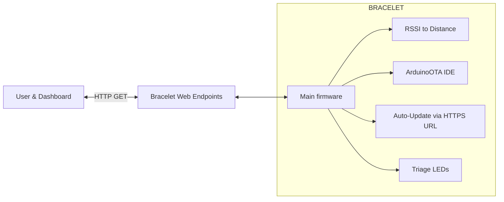

# RSSI Triage Bracelet — WiFiMulti roaming + OTA (IDE & HTTPS URL) + RSSI proximity

ESP8266/ESP32 bracelet firmware that estimates **proximity from Wi‑Fi RSSI**, drives **triage LEDs** (green/yellow/red) and demonstrates **two OTA modes**: ArduinoOTA (push from IDE) and **auto‑update by downloading a .bin from an HTTPS URL**. It also exposes simple HTTP routes you can read from a browser or hook to a tiny AJAX dashboard.

> **Note on WiFiMulti:** `WiFiMulti` gives *multi‑AP roaming/failover*. It is **not** a full mesh (no multi‑hop routing), but in practice improves resilience: if AP1 is down, the device re‑associates to AP2 automatically. For true mesh you’d use ESP‑NOW mesh or libraries like *painlessMesh*.

---

## Why this matters (IT/OT & IoT)

- **Edge telemetry & control**: local RSSI→distance estimation, LED feedback, and HTTP endpoints for dashboards.  
- **Resilience**: WiFiMulti handles roaming between known APs without manual intervention.  
- **Maintainability**: **OTA** via IDE (fast dev cycles) and **auto‑update over HTTPS** (field updates).  
- **Security posture**: HTTPS client (BearSSL) with fingerprint/CA support; creds kept in `wifi_secrets.h` (ignored by Git).

---

## Architecture


*(Endpoints are minimal text/JSON you can poll every 1–2 s.)*

---

## Repository layout

```
/firmware
  Triage_Bracelet_Firmware.ino   # main: WiFiMulti + ArduinoOTA + HTTPS client + basic WebServer + (optional) MySQL
  rssi_distance.ino              # RSSI -> distance (Friis-based)
  OTA_AutoUpdate_HTTPS.ino       # auto-update by URL (HTTPS) using ESPhttpUpdate
/docs
  wiring.md                      # optional notes
wifi_secrets.example.h           # template for SSID/PASS (copy to wifi_secrets.h)
ota_config.example.h             # template for FIRMWARE_URL (copy to ota_config.h)
.gitignore
LICENSE
README.md
```

> Copy `wifi_secrets.example.h` → **`wifi_secrets.h`** and `ota_config.example.h` → **`ota_config.h`**. Both are **.gitignored** so you do not publish secrets.

---

## Features by sketch

| File                            | WiFiMulti | RSSI→Distance | HTTP server | ArduinoOTA (IDE) | Auto‑update by URL | HTTPS/TLS |
|--------------------------------|:---------:|:-------------:|:-----------:|:----------------:|:------------------:|:---------:|
| `Triage_Bracelet_Firmware.ino` | ✅        | (integrate)   | ✅ (manual) | ✅               | ➖                 | ✅ (BearSSL) |
| `rssi_distance.ino`            | ➖        | ✅            | ➖          | ➖               | ➖                 | ➖        |
| `OTA_AutoUpdate_HTTPS.ino`     | ✅        | ➖            | ✅ (trigger)| ➖               | ✅                | ✅ (secure client) |

---

## Minimal endpoints (examples)

Expose a few text/JSON routes (either with `ESP8266WebServer` or by matching the first line of `WiFiServer` request):

- `GET /rssi` → `-62`  
- `GET /distance` → `2.8`  
- `GET /status` → `{ "rssi": -62, "distance_m": 2.8, "triage": "yellow" }`  
- `POST /update` (or `GET /update?now=1`) → runs **auto‑update** (see below).

---

## Auto‑update over **HTTPS** (ESP8266)

In `OTA_AutoUpdate_HTTPS.ino`, switch to a **secure** client before calling `ESPhttpUpdate`:

```cpp
#include <WiFiClientSecureBearSSL.h>
#include <ESP8266httpUpdate.h>
#include "wifi_secrets.h"
#include "ota_config.h"  // defines FIRMWARE_URL

void checkForUpdate() {
  std::unique_ptr<BearSSL::WiFiClientSecure> ssl(new BearSSL::WiFiClientSecure);
  ssl->setInsecure(); // DEMO only; in prod use setFingerprint() or setTrustAnchors()
  t_httpUpdate_return ret = ESPhttpUpdate.update(*ssl, FIRMWARE_URL);
  // handle ret == HTTP_UPDATE_OK / NO_UPDATES / FAILED...
}
```

For **production**, replace `setInsecure()` with either:
- `ssl->setFingerprint("AA BB CC ...");` *(SHA‑1 pinning)*, or
- `ssl->setTrustAnchors(&certStore);` *(CA)*.

On **ESP32**, use `HTTPUpdate` with `WiFiClientSecure` similarly.

---

## RSSI → distance (Friis‑based)

The helper in `rssi_distance.ino` reads `WiFi.RSSI()` and estimates distance using path loss at 2.4 GHz. Accuracy depends on environment (multipath, human body, antennas). Use **threshold bands** for triage:

- **Green**: `distance > d_green`  
- **Yellow**: `d_yellow < distance ≤ d_green`  
- **Red**: `distance ≤ d_yellow`

Log both RSSI and distance so you can tune thresholds with real data.

---

## WiFiMulti (roaming / failover)

Add your candidate APs and let the device pick the strongest/available one:

```cpp
WiFiMulti wifiMulti;
wifiMulti.addAP(WIFI_SSID_1, WIFI_PASS_1);
wifiMulti.addAP(WIFI_SSID_2, WIFI_PASS_2);
wifiMulti.addAP(WIFI_SSID_3, WIFI_PASS_3);
wifiMulti.run(); // call in setup() and periodically to reconnect
```

> It’s **not** multi‑hop mesh routing, but greatly improves availability in industrial floors with several APs.

---

## Quick start

1. Create secrets: copy `wifi_secrets.example.h` → `wifi_secrets.h` and fill SSIDs/PASS.  
2. (Optional) copy `ota_config.example.h` → `ota_config.h` and set `FIRMWARE_URL`.  
3. Open **`firmware/rssi_distance.ino`** → flash and check Serial: RSSI & distance.  
4. Open **`firmware/Triage_Bracelet_Firmware.ino`** → flash; verify WiFiMulti connects and ArduinoOTA is reachable from IDE.  
5. (Optional) Add endpoints `/rssi`, `/distance`, `/status` and test from browser or a simple AJAX page.  
6. Open **`firmware/OTA_AutoUpdate_HTTPS.ino`** → wire a button or HTTP trigger to call `checkForUpdate()`; serve a test `.bin` and verify auto‑update.

---

## Production notes

- Keep secrets in `wifi_secrets.h` and **never commit** them.  
- Protect update actions behind a token or button combo.  
- Telemetry rate: 1–2 s is fine; avoid flooding.  
- Calibrate RSSI thresholds per site; log a sample and compute percentiles.  

---

## License

MIT — see [LICENSE](LICENSE).